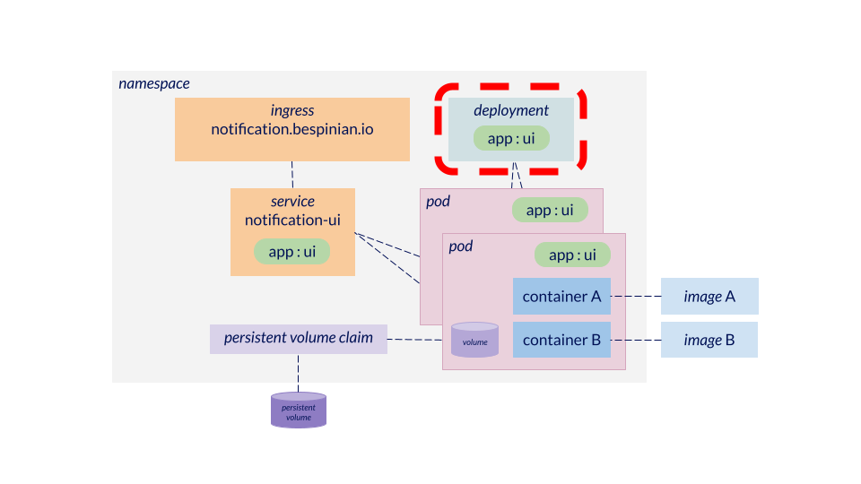

# Stateless workload: Deployments



[Deployments](https://kubernetes.io/docs/concepts/workloads/controllers/deployment) are the configuration objects in Kubernetes which represent an application component, deployed as a collection of replicated pods. Deployments can be deployed, updated, rolled back, scaled out, scaled in and deleted as one object. A Deployment always contains exactly one Pod-specification, which specifies the Pod which will be replicated. At runtime, Deployments and their pods are linked via label selection. Deployments assume that their Pods are stateless replicas which share nothing and which can be started and stopped as specified by the `spec.replicas`-Parameter.

## What should be configured as a Deployment?

A web application which can be scaled horizontally by adding more replicas, each handling a portion of the incoming http requests.

## What should not be configured as a Deployment?

Example 1: A highly available database which runs in several replicas which hold state and which need to know about each other and need to exchange replication information. Use a [StatefulSet](../StatefulSets/README.md) instead.

Example 2: Multiple heterogenous components of an application. Deployments are always based on one single Pod-specification. Use multiple Deployments for multiple different components.

## Examples

Use the following command to apply the deployment:

```
kubectl apply -f examples/nginx-deployment.yml
```

Use the following command to delete the deployment:

```
kubectl delete -f examples/nginx-deployment.yml
```
