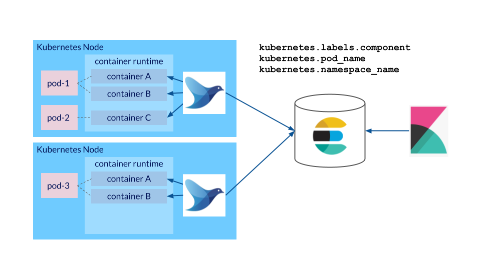

# Make your components log to stdout / stderr



Application components deployed to Kubernetes should always write their logs to the stdout or stderr streams and not to log files in the local file system. The reasons for this are that

1. we want logs to be readable via the `kubectl logs` command and
1. we want logs to be easily accessible to log aggregation solutions like fluentd which collect the logs of all containers on a Kubernetes cluster and forward them to a central logging platform and
1. logs stored in the local file system are lost when a container crashes.

## Rule of thumb

It should never be necessary to open an shell in a container in order to inspect the logs of an application container.

## Examples

Two pods, one logging to a file in the local `/var/log` directory, one logging to stdout. Use the following command to deploy the pods

```shell
kubectl apply -f examples/
```

Check the logs of `logging-wrong`

```shell
kubectl logs logging-wrong -f
```

As expected, there is nothing to see.

Now check the logs of `logging-right`

```shell
kubectl logs logging-right -f
```

Logs are visible, as expected.

Delete both Pods with the following command:

```shell
kubectl delete -f examples/
```
