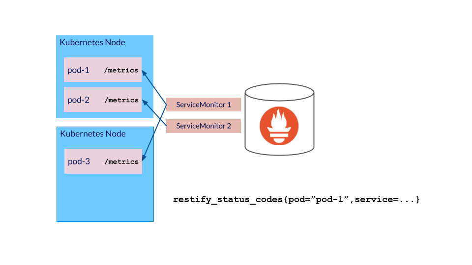

# Expose your component's metrics on an endpoint



In Kubernetes application metrics are typically scraped from each Pod and enriched with Kubernetes metadata (Namespace name, Pod name, container name etc.) by Prometheus. Thus application components need to expose application specific metrics in [Prometheus format](https://prometheus.io/docs/concepts/data_model/) on a metrics endpoint (by default named `/metrics`). Application components can then inform Prometheus about their metrics endpoint using the annotation `prometheus.io/path`.

A metrics endpoint is only required, if an application component wishes to monitor certain application-specific metrics. Generic metrics about resource usage and potential errors are collected automatically at cluster level.

## Example

An NGINX deployment with a sidecar container which exports metrics on port `9113` on the default `/metrics` endpoint. The deployment tells Prometheus about this endpoint using the annotations `prometheus.io/path` and `prometheus.io/port`.

Use the following command to create the Deployment:

```shell
kubectl apply -f examples/
```

Check the pod using

```shell
kubectl get pods -o wide
```

Confirm that the Pod exposes a `metrics` on port `9113` endpoint by running the following command:

```shell
kubectl run curl --image=curlimages/curl --rm -it -- curl <Pod IP>:9113/metrics
```

Use the following command to delete the Deployment:

```shell
kubectl delete -f examples/
```
