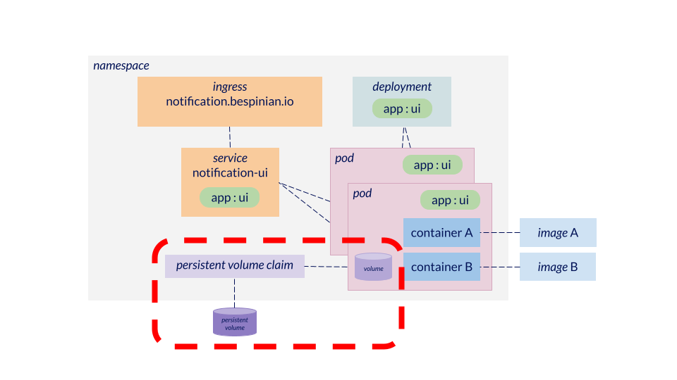

# Persistence

[Volumes](https://kubernetes.io/docs/concepts/storage/volumes/#emptydir) can be used in Kubernetes to share storage between containers in a Pod. However, by default Volumes (of type `emptyDir`) are not persistent, meaning that they are destroyed whenever the Pod is destroyed (which can happen during normal operation). This means that any data which needs to be persistent and independent of Pod-lifespan needs to be stored in a [Persistent Volume](https://kubernetes.io/docs/concepts/storage/persistent-volumes) which needs to be provisioned using a [Persistent Volume Claim](https://kubernetes.io/docs/concepts/storage/persistent-volumes/#reserving-a-persistentvolume).
