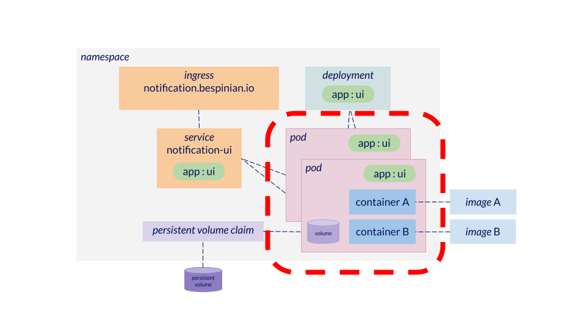

# What is a Pod?

[Pods](https://kubernetes.io/docs/concepts/workloads/pods) are the basic building blocks of applications in Kubernetes. They are the unit by which applications are scaled. A pod contains one or more containers and one or more volumes which all share a common lifespan (i.e. they are created and destroyed together). Pods have one IP address in a Kubernetes cluster and all containers in a pod communicate via `localhost` and a coordinated port space. Pods should never be considered as durable. They can be started, stopped and rescheduled as a part of normal cluster operation. Pods are usually not instantiated directly, but rather via higher level constructs such as Deployments and StatefulSets. Pods can be assigned arbitrarily many labels using which they are selected in other constructs.

## Which containers should go together in Pod?

Containers which are tightly coupled to provide a certain functionality should be co-located in a pod. Example: A container serving an api and a container which acts as an adaptor, transforming the data format of the api for certain clients.

## Which containers should not go together in Pod?

Containers which have different purposes and / or different lifespans in an overall application architecture. Example: a container serving an api and a container running a database on which the api is based.
