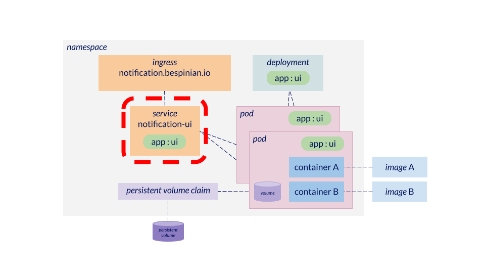

# Exposing your components: Services



Services are the configuration objects in Kubernetes which enable you to assign a stable name (and IP address) to an application component. A Service selects the Pods which belong to an application component via their labels. When created, it receives an IP address in the cluster and that IP address is registered in the cluster's DNS under the canonical name `<service-name>.<namespace-name>.svc.cluster.local`. Other application components in the cluster can then access the Service using that name. Furthemore, the Service will load-balance incoming traffic to all of its Pods. The default type of a Service is `ClusterIP`, which implements the behaviour just described. Another important Service-type is `LoadBalancer`. Services of type `LoadBalancer` receive additionally receive an IP on the network of the Kubernetes cluster nodes, allowing us to expose an application component outside of the Kubernetes cluster. There are other Service-types (`NodePort`, `ExternalName` and `Headless`), but these are used only in special circumstances.

## What should be configured as a Service?

Pods of an application component which needs to be consumed by other components in the Kubernetes cluster or by components outside of the Kubernetes cluster.

## What should not be configured as a Service?

Example 1: Pods which do not originate from the same Deployment or StatefulSet

Example 2: application components which do no need to be accessed from the outside world like timer-based tasks or event-driven components listening to a queue or an event topic.

Use the following command to create a Deployment and expose it through a Service:

```
kubectl apply -f examples/
```

Use the following command to delete the Service and the Deployment:

```
kubectl delete -f examples/
```
