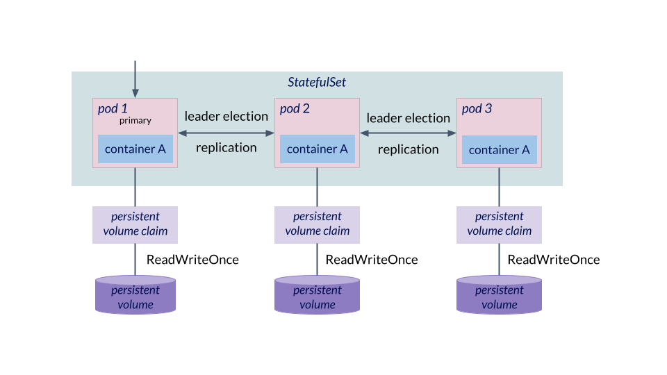

# Stateful workload: StatefulSets



[StatefulSets](https://kubernetes.io/docs/concepts/workloads/controllers/statefulset), like Deployments, are configuration objects for managing applications based on a collection of replicated pods. Like Deployments, they can be deployed, updated, rolled back, scaled out, scaled in and deleted as one object. Also like Deployments, they are based on exactly one Pod-specification, which specifies the Pod which will be replicated. However, unlike Deployments, StatefulSets keep track of the order in which its Pods were created and for each Pod of the persistent volumes that are used to hold its persistent state. This ensures that if one of the Pods of StatefulSet dies, another Pod can be scheduled and take over the persistent state of the dead Pod.

## What should be configured as a StatefulSet?

A highly available database which runs in several identical replicas which each hold state in their own storage and which need to know about each other, need to exchange replication information and elect a leader for write access.

## What should not be configured as a StatefulSet?

Example 1: A component with stateless replicas, which can be added and removed independently of each other.

Example 2: A legacy database technology which is based on integration via the storage system.

## Examples

Use the following command to deploy a MongoDB StatefulSet:

```
kubectl apply -f examples/
```

Use the following command to delete the StatefulSet:

```
kubectl delete -f examples/
```
