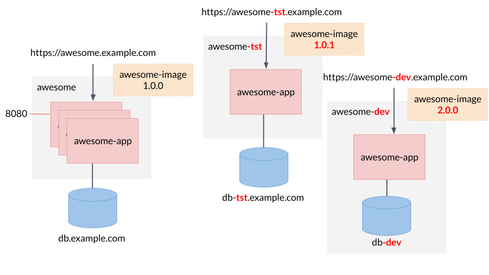

# Manage variants with the right tools

There are two main tools for managing variants and variations in your Kubernetes-based applications, [Kustomize](https://kustomize.io/) and [Helm](https://helm.sh/).

## Kustomize

Kustomize uses the approach of overlays to manage variants. It starts from a base of fully functional YAML files which describe an arbitrary set of Kubernetes resources. The resources described in this base usually reflect the productive deployment. For every variant Kustomize lets you define overlays and furthermore use some syntactic sugar for some things which vary frequently. An overlay can be viewed as a transformation from valid YAML to valid YAML.

### When to use Kustomize

- When you have a small number of variants, for example dev, test and prod environments of the same app
- When your variants vary in a few well-defined parameters, the values of which are all known in advance
- When there are no parameters which can take a potentially infinite number of different values (e.g. a domain name which is not known in advance)

### When not to use Kustomize

- When you have a potentially infinite number of variants, which you do not know in advance.
- When there are many different parameters which can vary to produce variants.
- When there are parameters which take a potentially infinite number of values.

In this case you should use Helm instead.

## Helm

Helm uses the approach of templates to manage variants. It starts from a set of template files comprised of YAML with Go-template expressions. For every variant you define an additional YAML file with the values which fill the customization points in the templates. The templates themselves are not valid Kubernetes YAML because they contain variables and template expressions.

### When to use Helm

- When you are building an application which will be distributed to customers who will deploy it in an unknown number of variants
- When you need to publish applications for others to consume. Helm uses so-called Helm repos for this purpose

### When not to use Helm

- When you have a small number of variants, for example dev, test and prod environments of the same app
- When your variants vary in a few well-defined parameters, the values of which are all known in advance
- When you have no need to distribute application variants to potentially unknown users.

In this case you should use Kustomize instead.
